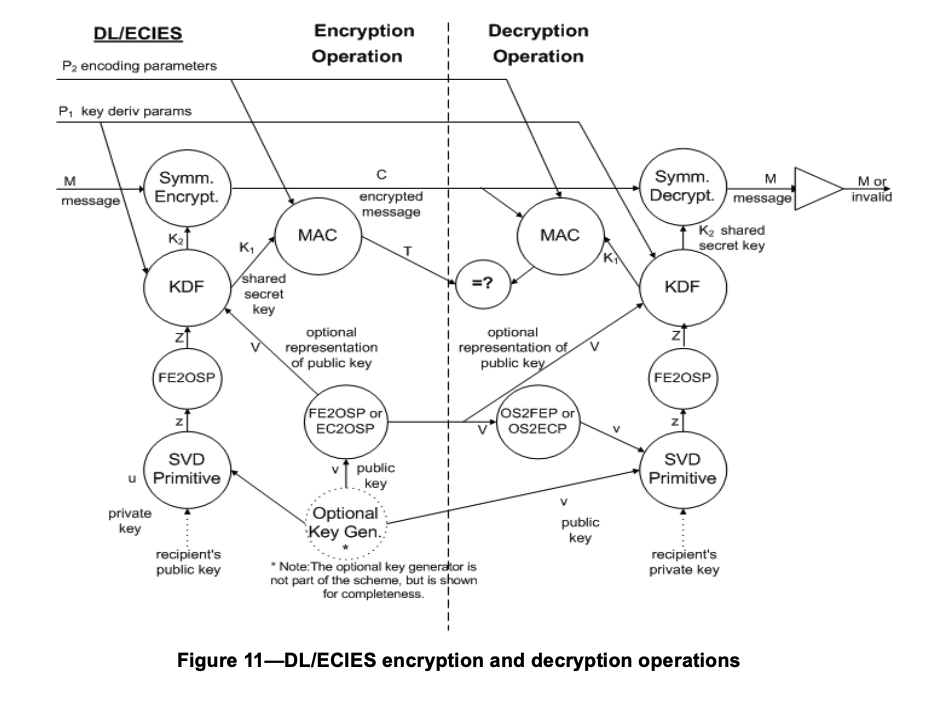

# Elliptic Curve Integration Encryption Scheme (ECIES) - IEEE 1363a

This package Implements DL/ECIES as per [IEEE 1363a-2004](https://standards.ieee.org/ieee/1363a/2050/) - We picked this standard, following the analysis of [Martinez et al](https://dl.acm.org/doi/abs/10.1080/01611194.2014.988363).

DL/ECIES is Discrete Logarithm and Elliptic Curve Integrated Encryption Scheme. It is based on the work of Abdalla et al. [ABR98] and ANSI X9.63 [B12].

## Remark

ECIES, if implemented from a standard, will not have any AES-GCM/AEAD etc and what's commonly implemented as ECIES isn't *strictly-speaking* standerdized. Although this package implements a standerdized ECIES, **WE DO NOT RECOMMEND ACTUALLY USING IT**. Use the newer and simpler HPKE instead.

## Preset Options:
- Secret value determination primitive is `ECSVDP-DHC` (compatibility with DH mode is preset, assuming the the corresponding primitive remains the one we've implemented)
- Encryption Method: AES-256 in CBC mode.
- Message Authentication code HMAC-SHA-512.
- KDF is KDF2.
- Hash is SHA-512.
- DHAES mode is preset ie. we include a representation of the sender's public key as an input to the key derivation function. Given that we use cofactored diffie hellman, this is to prevent "Benign Malleability" discussed in [SH01].

## Parties:
ECIES may be used in the context of Alice sending an encrypted message to Bob. In this case, Alice is the **SENDER** and Bob is the **RECEIVER**.
ECIES may be used for secure storage of sensitive material by Alice. In this case, Alice is the **SENDER**, and the receiver is an ephemeral key-pair generated during encryption, with the ephemeral secret key removed at the end of the encryption session. (roles will be reversed for decryption) The recommendation is to use a unique ephemeral key pair for each encryption.
Alice may re-use her keypair for different encryptions if needed.

## Input:
- **ENCRYPTION**:
    - The EC domain parameters q, a, b, r, G, and the cofactor associated with the keys s and W′ (the domain parameters shall be the same for both s and W′) - Notation defined in 7.1.1
    - The sender's own private key s
    - Receiver's publicKey: W′
    - Let L2 of length 8 octet string to be the bit length of the encoding paramater. (for HMAC-SHA-512 it would be 64)

- **DECRYPTION**:
    - The EC domain parameters q, a, b, r, G, and the cofactor associated with the keys s and W′ (the domain parameters shall be the same for both s and W′) - Notation defined in 7.1.1
    - The receiver's own private key w'
    - The sender's public Key Y
    - Let L2 of length 8 octet string to be the bit length of the encoding paramater. (for HMAC-SHA-512 it would be 64)

## Operations:

1. **ENCRYPTION**
   1. **ABORT** If sender public key is not on the curve.
   2. Compute shared secret value $z$ from sender private key $s$ and the receiver public key $W^{\prime}$ using ECSVDP-DHC.
   3. Convert $z$ to an octet string $Z$ (using FE2OSP will be implicit).
   4. Convert sender's public key to an octct string $V$.
   5. Let VZ = V || Z.
   6. Derive shared secret key K from VZ using HKDF. The bit length will be k1+k2 where k1 is the bit length of the key for AES CBC and k2 is the bit length of the key for HMAC. Let K1 be the leftmost k1 bits and let K2 be the remaining k2 bits.
   7. Encrypt message under K1 with AES-256 in CBC mode to get ciphertext C.
   8. Apply HMAC-SHA-512 to the ciphertext C, the encoding parameters P2 and the length L2 under the key K2 to produce authentication tag T=HMAC_K2(C || P_2 || L_2) (P2 may contain AD)
   9. **OUTPUT** the triple (V, C, T) as the ciphertext.

2. **DECRYPTION**:
   1. **ABORT** If receiver public key is not on
   2. Compute shared secret value $z$ from receiver's private key $w$ and the sender public key $Y$ using ECSVDP-DHC.
   3. Convert $z$ to an octet string $Z$ (using FE2OSP will be implicit).
   4. Convert sender's public key to an octct string $V$.
   5. Let VZ = V || Z.
   6. Derive shared secret key K from VZ using HKDF. The bit length will be k1+k2 where k1 is the bit length of the key for AES CBC and k2 is the bit length of the key for HMAC. Let K1 be the leftmost k1 bits and let K2 be the remaining k2 bits.
   7. Decrypt C under K1 with AES-256 in CBC mode to get message M.
   8. Apply HMAC-SHA-512 to the ciphertext C, the encoding parameters P2 and the length L2 under the key K2 to reproduce authentication tag T'=HMAC_K2(C || P_2 || L_2) (P2 may contain AD)
   9. **ABORT** if T != T'
   10. **OUTPUT** M

## References:
- [ABR98] Abdalla, M., Bellare, M., and Rogaway, P., “DHAES: An Encryption Scheme Based on the DiffieHellman Problem,” submission to IEEE P1363a, Sept. 1998.
- [B12] ANSI X9.63-2002, Public Key Cryptography for the Financial Services Industry: Key Agreement and Transport Using Elliptic Curve Cryptography.
- [SH01] Shoup, V., 2001. A proposal for an ISO standard for public key encryption. Cryptology ePrint Archive, Report 2001/112, http://www.shoup.net/papers/iso-2_1.pdf.
